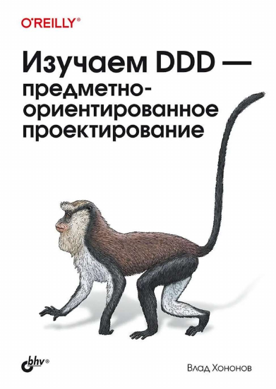

# Изучаем DDD — Влад Хононов

Как связать устройство кода с устройством бизнеса: сначала разобрать предметную область на части и провести между ними границы, затем выбрать под каждую часть подходящий способ реализации. Оригинал — *Learning Domain-Driven Design* (O'Reilly, 2022), русское издание — БХВ-Петербург, 2024.

**Структура:** часть I — стратегическое проектирование (поддомены, единый язык, ограниченные контексты, их интеграция); часть II — тактический замысел (паттерны бизнес-логики, архитектуры и коммуникации); часть III — применение на практике (эвристики, эволюция, EventStorming); часть IV — связь с микросервисами, EDA и data mesh.

**Сквозной пример книги — WolfDesk:** SaaS-система управления заявками в службу поддержки. Мультиарендная, платит арендатор не за пользователей, а за число заявок за период, с автоматическими оптовыми скидками (10% от 500 заявок, 20% от 750, 30% от 1000) и без минимального платежа. Отсюда всё остальное: автозакрытие неактивных заявок, антифрод против склеивания разных тем в одну заявку, автопилот поддержки, ищущий решение в истории заявок арендатора, SSO, графики смен агентов и бессерверная инфраструктура ради дешёвого подключения нового арендатора.

---

## Содержание

**[Часть I. Стратегическое проектирование](#часть-i-стратегическое-проектирование)**

- [Глава 1. Анализ предметной области](#глава-1-анализ-предметной-области)
- [Глава 2. Экспертные знания о предметной области](#глава-2-экспертные-знания-о-предметной-области)
- [Глава 3. Как осмыслить сложность предметной области](#глава-3-как-осмыслить-сложность-предметной-области)
- [Глава 4. Интеграция ограниченных контекстов](#глава-4-интеграция-ограниченных-контекстов)

**[Часть II. Тактический замысел](#часть-ii-тактический-замысел)**

- [Глава 5. Реализация простой бизнес-логики](#глава-5-реализация-простой-бизнес-логики)
- [Глава 6. Проработка сложной бизнес-логики](#глава-6-проработка-сложной-бизнес-логики)
- [Глава 7. Моделирование фактора времени](#глава-7-моделирование-фактора-времени)
- [Глава 8. Архитектурные паттерны](#глава-8-архитектурные-паттерны)
- [Глава 9. Паттерны взаимодействия](#глава-9-паттерны-взаимодействия)

**[Часть III. Применение DDD на практике](#часть-iii-применение-ddd-на-практике)**

- [Глава 10. Эвристика проектирования](#глава-10-эвристика-проектирования)
- [Глава 11. Эволюция проектных решений](#глава-11-эволюция-проектных-решений)
- [Глава 12. EventStorming](#глава-12-eventstorming)
- [Глава 13. DDD на практике](#глава-13-ddd-на-практике)

**[Часть IV. Взаимоотношения с другими методологиями](#часть-iv-взаимоотношения-с-другими-методологиями)**

- [Глава 14. Микросервисы](#глава-14-микросервисы)
- [Глава 15. Событийно-ориентированная архитектура](#глава-15-событийно-ориентированная-архитектура)
- [Глава 16. Сеть данных, Data Mesh](#глава-16-сеть-данных-data-mesh)

- [Приложение 1. Применение DDD: пример из практики](#приложение-1-применение-ddd-пример-из-практики)
- [Шпаргалка](#шпаргалка)

# Часть I. Стратегическое проектирование

## Глава 1. Анализ предметной области

Глава не про код, а про то, как работает компания: почему она существует и чем отличается от конкурентов. Не разобравшись в этом, невозможно выбрать, куда вкладывать инженерные усилия.

**Термины**
- **Предметная область (domain)** — сфера деятельности компании, услуга для клиентов: FedEx — доставка, Starbucks — кофе. Компания может работать сразу в нескольких.
- **Поддомен (subdomain)** — чётко очерченная область деловой активности; технически — набор согласующихся сценариев использования (use cases) с общими участниками и данными. Домен складывается из поддоменов.
- **Основной поддомен (core)** — то, чем компания отличается от конкурентов: изобретение, оптимизация, ноу-хау.
- **Универсальный поддомен (generic)** — то, что все делают одинаково: аутентификация, шифрование, бухучёт.
- **Вспомогательный поддомен (supporting)** — бизнесу нужен, преимущества не даёт; логика уровня CRUD и ETL.
- **Эксперт предметной области (domain expert)** — носитель бизнес-знаний: постановщик требований или конечный пользователь, но не аналитик и не разработчик.

| Тип | Преимущество | Сложность | Изменчивость | Реализация | Задача |
|---|---|---|---|---|---|
| Основной | да | высокая | высокая | самостоятельно | интересная |
| Универсальный | нет | высокая | низкая | купить/взять готовое | решённая |
| Вспомогательный | нет | низкая | низкая | самостоятельно или аутсорс | банальная |

**Ключевое**
- Тип поддомена диктует стратегию: на core — лучшие люди и самые продвинутые методы проектирования, generic — купить, supporting — сделать максимально просто, отдать на аутсорс или растить на нём новичков.
- Отличить core от supporting: может ли это стать отдельным бизнесом, заплатит ли кто-то за это? Отличить supporting от generic: дешевле написать самому, чем интегрировать готовое?
- Core не обязательно технический. У производителя украшений core — дизайн, а интернет-магазин универсален. У компании ручного антифрода core — работа аналитиков, а не система, которая показывает им документы.
- Дробить поддомены, пока дробление вскрывает стратегическую информацию. Остановиться, когда более мелкие части оказываются того же типа, что и целое.

**Пример из книги.** Отдел обслуживания клиентов целиком выглядит универсальным. Внутри: справочная служба и телефонная станция — generic, управление сменами — supporting, а собственный алгоритм маршрутизации обращений к агентам, успешно закрывавшим похожие случаи, — core, потому что он даёт качество обслуживания выше, чем у конкурентов.

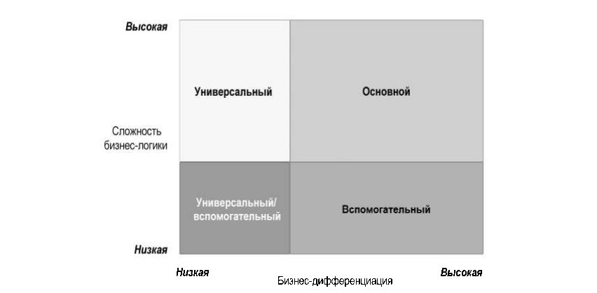

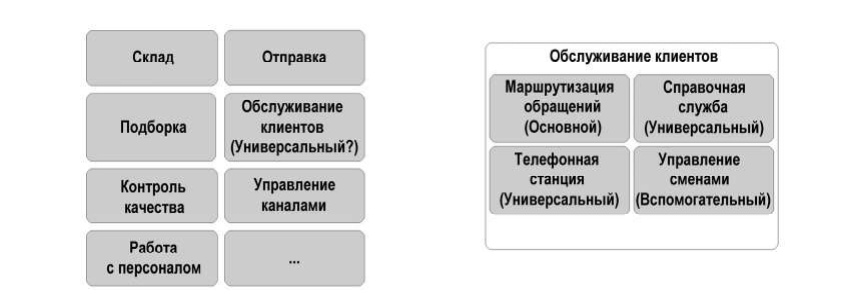

## Глава 2. Экспертные знания о предметной области

> В прод идут не знания экспертов в предметной области, в прод идут предположения разработчиков.
> — Альберто Брандолини

Разработка ПО — это процесс обучения, а работающий код — побочный эффект. Знания теряются на каждом переводе: предметная область → аналитическая модель → требования → дизайн → код. Лекарство — не улучшать переводы, а убрать их.

**Термины**
- **Единый язык (ubiquitous language)** — один общий язык для всех участников проекта, состоящий только из понятий бизнеса, без технического жаргона. Используется в разговорах, требованиях, тестах, документации и коде.
- **Модель** — упрощённое представление, намеренно подчёркивающее одни аспекты и игнорирующее другие; абстракция под конкретное применение. Канонический пример — карта: по карте метро нельзя оценить расстояния, и это нормально.
- **Модель предметной области** — отражение ментальных моделей экспертов: объекты, их поведение, причинно-следственные связи и инварианты, ровно в том объёме, который нужен для решаемой задачи.

**Ключевое**
- Согласованность языка важнее его полноты. Один термин — одно значение: если *policy* означает и политику, и договор страхования, в языке должно быть два разных понятия.
- Синонимы почти всегда скрывают разные понятия: *visitor* и *account* технически оба пользователи, но посетитель нужен для аналитики, а учётная запись реально работает с системой.
- Глоссарий в вики хорошо ловит существительные и плохо — поведение. Поведение фиксируют сценарии использования и Gherkin-тесты, которые эксперт может прочитать и проверить. Инструменты вторичны: язык живёт в ежедневном общении, а не в документации.
- Выявление знаний часто оказывается не извлечением готового, а совместным построением модели: у экспертов тоже бывают пробелы, и вопросы о граничных случаях вскрывают их. Особенно это касается основных поддоменов.
- В неанглоязычной компании автор советует брать хотя бы английские существительные для названий объектов — чтобы та же терминология работала в коде.

**Пример из книги.** На языке бизнеса: «рекламная кампания может быть запущена, только если активно хотя бы одно из её мест размещения». То же самое технически: «кампания запускается при наличии хотя бы одной связанной записи в таблице активных мест размещения». Второе эксперт не поймёт и не проверит, а разработчик, знающий только его, не поймёт, почему правило именно такое.

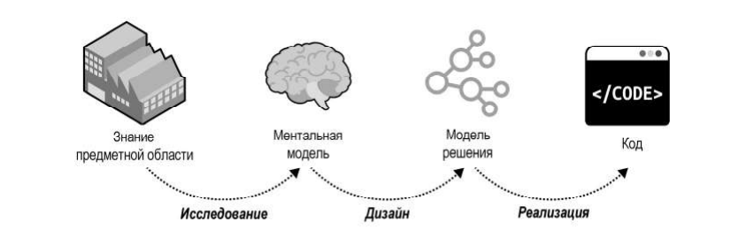

## Глава 3. Как осмыслить сложность предметной области

Единый язык обязан быть непротиворечивым, но ментальные модели экспертов из разных отделов противоречат друг другу. Выход — не одна модель на всех, а несколько языков с явно очерченными областями применения.

**Термины**
- **Ограниченный контекст (bounded context)** — граница применимости единого языка и его модели. Внутри контекста каждый термин имеет ровно одно значение; в соседнем контексте тот же термин может значить другое.
- **Область задач (problem domain)** — часть предметной области, под которую строится отдельная модель.

**Ключевое**
- Единый язык не «повсеместный»: он не универсален для всей организации, а действует только внутри своего ограниченного контекста. Без явного контекста язык вообще нельзя определить.
- **Поддомены выявляются, ограниченные контексты проектируются.** Поддомены задаёт бизнес-стратегия, границы контекстов выбирает разработчик под конкретный проект и ограничения. Один контекст может включать несколько поддоменов, а может совпадать с одним.
- Размер контекста сам по себе ничего не решает: чем шире границы, тем труднее удержать непротиворечивость; чем мельче — тем дороже интеграция. Нельзя только одно: разрывать связанную функциональность между контекстами, иначе одни и те же изменения будут требовать одновременного релиза обоих.
- Контекст — это ещё и физическая граница (отдельный сервис со своим стеком и жизненным циклом) и граница владения: **над одним контекстом работает ровно одна команда**, хотя команда может вести несколько контекстов. Это заставляет команды явно договариваться о протоколах вместо неявных предположений о моделях друг друга.
- Два неудачных решения конфликта моделей: одна общая ERD-модель на всю компанию («обо всём и ни о чём») и префиксы вроде *marketing lead* / *sales lead* — они грузят голову и не совпадают с тем, как люди говорят на самом деле.

**Пример из книги.** В телемаркетинговой компании *lead* для маркетинга — событие получения контактных данных, а для продаж — весь жизненный цикл сделки, долгий процесс. Перенести модель продаж в маркетинг значит утащить туда лишнюю сложность; упростить до маркетинговой — сломать продажи. Правильный ответ: два ограниченных контекста, в каждом свой *lead*.

**Ещё пример.** Помидор: в ботанике фрукт, в кулинарии овощ, а в контексте налогообложения США — овощ по решению Верховного суда 1893 года. И картонка, вырезанная по габаритам холодильника, — полноценная модель: она отвечает на вопрос «пройдёт ли в дверь», и 3D-модель здесь была бы переусложнением.

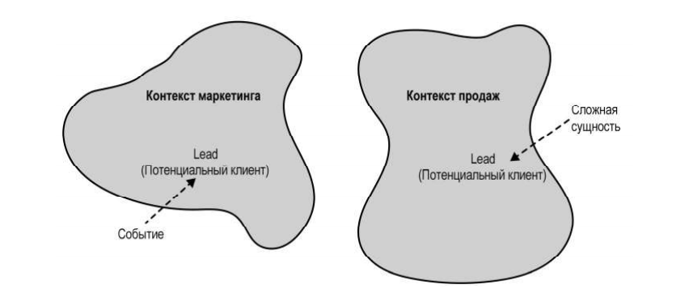

## Глава 4. Интеграция ограниченных контекстов

Контексты развиваются независимо, но независимыми не бывают: в точках соприкосновения появляются контракты. Паттерн интеграции определяется не техникой, а характером отношений между командами — три группы, шесть паттернов.

**Сотрудничество (cooperation)** — команды тесно общаются, успех одной зависит от успеха другой.
- **Партнёрство (partnership)** — интеграция координируется по ситуации: одна команда предупредила об изменении API, вторая подстроилась. Нужны частая синхронизация и непрерывная интеграция; плохо работает при географическом разрыве.
- **Общее ядро (shared kernel)** — общий кусок модели, принадлежащий нескольким контекстам сразу. Связывает их жизненные циклы, поэтому в ядро выносят минимум: контракты интеграции и структуры передаваемых данных. Применять, только когда координация дешевле дублирования — то есть на самых изменчивых, основных поддоменах. Формально нарушает правило «один контекст — одна команда», это осознанное исключение (география, оргполитика, постепенное распиливание легаси).

**Потребитель-поставщик (customer-supplier)** — поставщик выше по течению (upstream), потребитель ниже (downstream), команды успешны независимо, и потому возникает дисбаланс сил.
- **Конформист (conformist)** — потребитель принимает модель поставщика как есть. Оправдано, если контракт стандартный и достаточно удобный.
- **Предохранительный слой (anticorruption layer, ACL)** — потребитель переводит чужую модель в свою. Нужен, когда ниже по течению основной поддомен, когда модель поставщика неудачна (типично для легаси) или когда его контракт часто меняется: тогда изменения бьют только по слою трансляции.
- **Сервис с открытым протоколом (open-host service, OHS)** — поставщик отделяет публичный интерфейс от внутренней модели. Этот интерфейс — **опубликованный язык (published language)**, он выражен удобно для потребителей, а не на едином языке поставщика. Зеркальное отражение ACL: переводит поставщик. Позволяет держать несколько версий языка одновременно и переводить потребителей постепенно.

**Разные пути (separate ways)** — сотрудничества нет, функциональность дублируется. Причины: трудности общения в большой организации, универсальный поддомен, который проще подключить локально (пример — фреймворк логирования: выставлять его сервисом дороже, чем продублировать), или модели настолько разные, что ACL дороже дублирования. **Для основных поддоменов этот паттерн не годится.**

**Карта контекстов (context map)** — схема контекстов и их связей. Показывает не только устройство системы, но и организацию: если все потребители одной команды строят против неё ACL или все «разные пути» сходятся к одной команде — это диагноз. Ведётся совместно, каждая команда обновляет свои интеграции; поддерживается как код, например в Context Mapper.

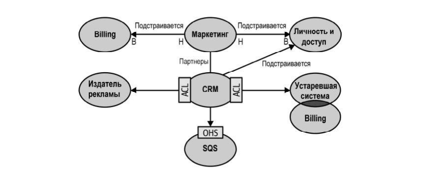

---

# Часть II. Тактический замысел

## Глава 5. Реализация простой бизнес-логики

Два паттерна для простой логики. Оба выглядят примитивно, но именно на них чаще всего ломается согласованность данных.

**Термины**
- **Транзакционный сценарий (transaction script)** — бизнес-логика как набор процедур, каждая обслуживает одну операцию публичного интерфейса. Единственное жёсткое требование: операция либо целиком удалась, либо целиком провалилась — с откатом или компенсацией.
- **Активная запись (active record)** — объект, представляющий строку таблицы и инкапсулирующий доступ к данным: структура плюс CRUD-методы, обычно через ORM. Логика по-прежнему живёт в транзакционных сценариях, но они работают не с базой напрямую, а с объектами.

**Три способа сломать транзакционность (все из практики автора)**
1. **Нет транзакции.** Два подряд идущих `UPDATE` и `INSERT` без обёртки: сбой между ними оставляет систему в несогласованном состоянии.
2. **Распределённая транзакция.** Запись в базу и следом публикация сообщения в шину. Обернуть в общую транзакцию нельзя; решается CQRS (гл. 8) и паттерном исходящих сообщений (гл. 9).
3. **Неявная распределённая транзакция.** `UPDATE Users SET visits = visits + 1` — одна таблица, одна база, и всё равно распределённая транзакция: результат сообщается ещё и вызывающей стороне. Если ответ до неё не дошёл, она повторит вызов и счётчик вырастет на 2. Лечится идемпотентностью (передавать новое значение счётчика, а не инкремент) или оптимистической блокировкой (`WHERE visits = @expected`).

**Ключевое**
- Оба паттерна годятся для вспомогательных поддоменов, интеграции с универсальными и для слоёв трансляции моделей. В основном поддомене транзакционный сценарий применять нельзя: логика начнёт дублироваться между процедурами и разъедется, превратившись в «большой ком грязи».
- Активная запись — это не «анемичная модель» и не антипаттерн, а инструмент: вред приносит и он не на своём месте, и переусложнённый паттерн на простой логике.
- Прагматизм тоже решение: при миллиардах событий от IoT-устройств потеря или дублирование 0,001% может быть приемлемой ценой. Важно, чтобы это был осознанный, оценённый риск.

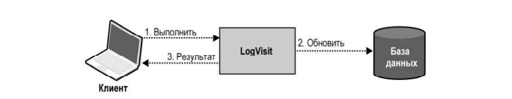

## Глава 6. Проработка сложной бизнес-логики

Паттерн **модели предметной области (domain model)** — объектная модель, содержащая и данные, и поведение, без инфраструктуры внутри (обычные объекты, не знающие про базу). Применяется там, где вместо CRUD идут сложные переходы состояний, бизнес-правила и инварианты, то есть в основном поддомене. Тактические паттерны Эванса — агрегаты, объекты-значения, доменные сервисы — это строительные блоки данного паттерна.

**Объект-значение (value object)** — понятие, опознаваемое по самим значениям, без поля идентификатора: цвет однозначно задан своими R, G, B, и отдельный `ColorId` тут только плодит ошибки. Свойства:
- **Неизменяемость.** Смена поля создаёт новое значение, поэтому методы возвращают новый экземпляр; равенство переопределяется по значениям. Побочных эффектов нет, объекты потокобезопасны.
- **Лекарство от одержимости примитивами.** Вместо семи строк и целых чисел в `Person` — `PhoneNumber`, `EmailAddress`, `Height`, `CountryCode`: валидация переезжает внутрь типа, соглашения («в этой строке телефон») исчезают, а связанная логика перестаёт дублироваться.
- Использовать при любой возможности, особенно для свойств сущностей, состояний, паролей и **денег** — примитивы для денег дают ошибки округления и точности.

**Сущность (entity)** — объект с явным идентификатором, который не меняется всю жизнь объекта; состояние меняться может. Двух разных людей с одинаковым именем различает только `PersonId`. Сущности не существуют сами по себе — только внутри агрегата.

**Агрегат (aggregate)** — иерархия сущностей и объектов-значений с общей транзакционной границей. Это центральный паттерн главы:
- **Граница согласованности.** Менять состояние может только собственная бизнес-логика агрегата; снаружи поля доступны лишь на чтение, а изменения идут через **команды** публичного интерфейса. Вся логика оказывается в одном месте, а слой приложения (application layer) становится тонким: загрузить агрегат, выполнить команду, сохранить.
- **Граница транзакции.** Одна транзакция — один экземпляр агрегата. Потребность сохранить два агрегата разом означает, что границы проведены неверно. Хранилище обязано поддерживать контроль конкурентного доступа: поле версии и `WHERE ... AND agg_version = @expected`.
- **Проектировать как можно меньшими.** Внутрь входит только то, что обязано быть строго согласованным; всё, что терпит согласованность в конечном счёте (eventual consistency), выносится в другой агрегат и связывается по идентификатору.
- **Корень агрегата (aggregate root)** — единственная сущность, через которую внешний мир работает с иерархией: пометить сообщение прочитанным можно только командой `Ticket`, не трогая `Message` напрямую.
- **События предметной области (domain events)** — сообщения о том, что уже произошло, потому именуются в прошедшем времени: `ticket-escalated` с причиной и временем. Часть публичного интерфейса агрегата; на них подписываются другие агрегаты, процессы и внешние системы.

**Доменный сервис (domain service)** — объект без состояния для логики, которая не принадлежит ни одному агрегату или требует чтения нескольких. Правило «один агрегат на транзакцию» он не отменяет. К микросервисам и SOA отношения не имеет.

**Почему это упрощает, а не усложняет.** Сложность системы — это число степеней свободы. Класс с пятью независимыми полями имеет пять степеней свободы; класс, где три поля вычисляются из двух, — две, хотя кода в нём больше. Агрегаты и объекты-значения инкапсулируют инварианты и тем сокращают степени свободы.

**Пример из книги.** Правило службы поддержки: «если агент не открыл эскалированную заявку за половину отведённого времени, она переназначается другому». Проверка требует одновременно статуса эскалации, остатка времени и списка непрочитанных сообщений — значит, сообщения обязаны лежать внутри агрегата `Ticket`. Будь они согласованы в конечном счёте, часть заявок переназначалась бы зря. А вот клиент, продукты и назначенный агент в границу не входят и хранятся идентификаторами.

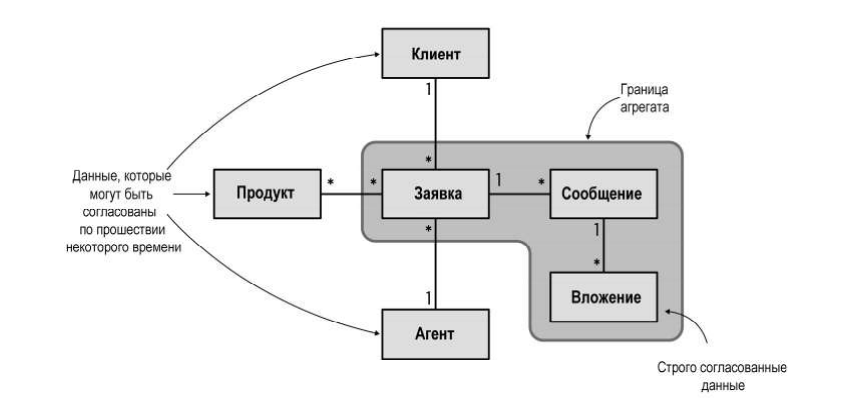

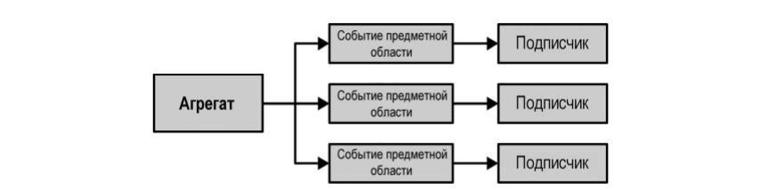

## Глава 7. Моделирование фактора времени

Та же сложная логика и те же строительные блоки, что в главе 6, но состояние хранится иначе.

**Термины**
- **События как источник данных (event sourcing)** — вместо текущего состояния сохраняются события, описывающие каждое изменение. Они и есть источник истины.
- **Модель предметной области, основанная на событиях (event-sourced domain model)** — агрегаты, чей жизненный цикл целиком выражен событиями. Автор специально разводит термины: event sourcing применим и без строительных блоков модели предметной области.
- **Хранилище событий (event store)** — база только на добавление, без изменения и удаления. Минимум операций: `Fetch(instanceId)` и `Append(instanceId, events, expectedVersion)`, где `expectedVersion` даёт оптимистичный контроль конкурентного доступа.
- **Проекция (projection)** — логика, последовательно применяющая события и собирающая из них представление состояния.

**Ключевое**
- Цикл операции: загрузить события → спроецировать состояние → выполнить команду → дописать новые события.
- **Проекций может быть сколько угодно, и новые добавляются задним числом** — по уже накопленным событиям. Это главное практическое отличие от таблицы состояний.
- Преимущества: путешествие во времени (в том числе для ретроспективной отладки — вернуть агрегат в состояние, где нашли баг), аналитика по истории, журнал аудита по умолчанию (важно там, где его требует закон, и там, где ходят деньги), и умное разрешение конфликтов — можно посмотреть, какие именно события добавились параллельно, и решить, мешают ли они.
- Недостатки: кривая обучения, тяжёлая эволюция схемы событий (события неизменяемы — этому посвящена отдельная книга Грега Янга) и архитектурная сложность.
- Производительность: деградация заметна примерно после 10 000 событий на агрегат, тогда как типичный агрегат живёт меньше 100. Срезы состояния (snapshot) — оптимизация, которую надо обосновать; если она понадобилась, сначала перепроверьте границы агрегата. Масштабирование — сегментирование по идентификатору агрегата.
- GDPR и удаление: **забываемая полезная нагрузка (forgettable payload)** — чувствительные данные лежат в событиях в шифрованном виде, ключ хранится отдельно по идентификатору агрегата; удаление ключа делает данные недоступными.

**Пример из книги.** Таблица лидов телемаркетинга показывает текущий статус каждого лида — и не отвечает ни на один интересный вопрос: сколько было звонков до конверсии, стоит ли вообще перезванивать после N попыток. Те же данные как поток событий (`lead-initialized` → `contacted` → `followup-set` → `contact-details-updated` → `contacted` → `order-submitted` → `payment-confirmed`) дают историю: связались через два часа, договорились перезвонить через неделю и на другой номер, заодно исправили опечатку в фамилии, оплата пришла через полчаса вместо отведённых трёх дней. Из тех же событий строится проекция для поиска (все когда-либо использованные имена и телефоны) и проекция для аналитики (счётчик повторных звонков).

**Почему не проще.** Писать журнал в файл — транзакция на два хранилища, они разъедутся. Писать в таблицу истории руками — кто-нибудь однажды забудет. Триггер в базе даст сухой перечень изменённых полей без «почему», а без «почему» новых проекций уже не построить.

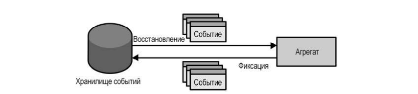

## Глава 8. Архитектурные паттерны

Как связать бизнес-логику с вводом, выводом и хранилищами. Три паттерна, каждый под свой паттерн бизнес-логики.

**Слоистая архитектура (layered architecture)** — горизонтальные слои с зависимостями строго сверху вниз: представление (presentation) → бизнес-логика (business logic) → доступ к данным (data access). В современных системах слой представления шире, чем UI: это весь публичный интерфейс, включая CLI, API и подписки на брокер сообщений; слой доступа к данным — это все хранилища и внешние провайдеры. Часто добавляют **сервисный (прикладной) слой** — фасад, куда переезжает оркестрация и управление транзакцией из контроллера: его переиспользуют и UI, и API. Если логика уже реализована транзакционным сценарием, отдельный сервисный слой не нужен — сценарий сам им и является. Подходит для транзакционного сценария и активной записи и плохо подходит для модели предметной области: та не должна знать об инфраструктуре, а здесь зависимость направлена как раз к ней.

**Порты и адаптеры (ports and adapters)** — слои представления и доступа к данным сливаются в инфраструктурный, зависимости инвертируются (DIP), бизнес-логика встаёт в центр и ни от чего не зависит. Она объявляет **порты** (интерфейсы вроде `IMessaging`), инфраструктура поставляет **адаптеры** (`SQSBus`) через внедрение зависимостей. Он же гексагональная, луковичная и чистая архитектура — разные названия одного набора принципов. Подходит для модели предметной области.

**CQRS (command-query responsibility segregation)** — те же принципы, но данные представлены несколькими моделями хранения.
- **Модель выполнения команд** — единственный источник истины: строго согласованная, с оптимистичным контролем конкурентного доступа.
- **Модели чтения (проекции)** — доступны только на чтение, их можно стереть и пересобрать с нуля, а новые добавлять задним числом.
- Проецирование бывает **синхронным** (догоняющая подписка: движок читает записи после контрольной точки, обновляет проекции, сохраняет новую точку) и **асинхронным** (модель команд публикует изменения в шину). Асинхронное лучше масштабируется, но ломается на переупорядоченных и продублированных сообщениях, и с ним трудно пересобрать проекции. Правило автора: сначала синхронная проекция, асинхронная — надстройкой над ней.
- Распространённое заблуждение: «команда не должна ничего возвращать». Должна — как минимум результат и причину отказа, а часто и данные для UI. Ограничение одно: возвращать только из строго согласованной модели команд.
- Причины применять: мультипарадигменное хранение (у каждой базы свои недостатки — реляционная для команд, поисковый индекс для поиска, колоночная для аналитики), разные представления для OLTP и OLAP, и обязательно — event sourcing, где иначе нельзя выбирать записи по состоянию.

**Ключевое.** Ни один из трёх паттернов не выбирается на весь ограниченный контекст. Контекст обычно накрывает несколько поддоменов разных типов, и единая архитектура на всех даёт лишнюю сложность. К горизонтальным слоям добавляются вертикальные границы модулей — по одному на поддомен, каждый со своим паттерном. Позже (гл. 11) эти логические границы можно превратить в физические.

**Разница слоёв и уровней.** Слой (layer) — логическая граница, живущая в общем жизненном цикле; уровень (tier) в N-tier — независимо развёртываемый физический компонент. Браузер, обратный прокси, веб-сервер и сервер базы — это уровни; слои существуют внутри веб-приложения.

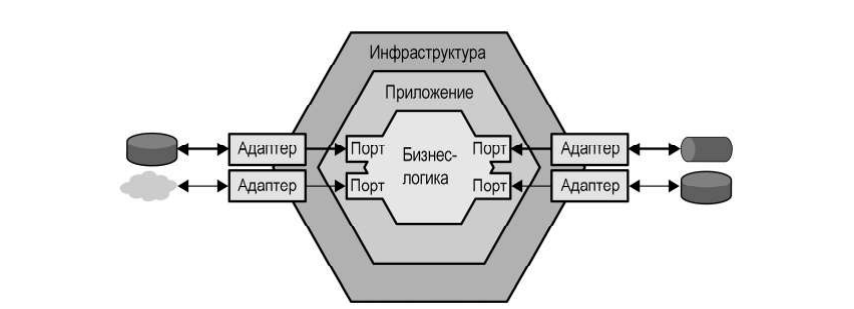

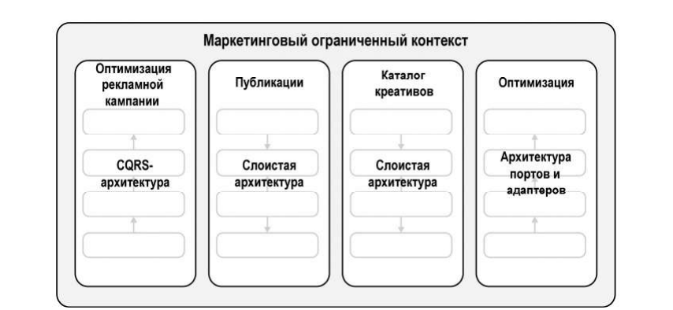

## Глава 9. Паттерны взаимодействия

Как компоненты обмениваются данными: трансляция моделей, надёжная публикация событий и процессы поверх нескольких агрегатов.

**Преобразование моделей.** Логика трансляции одинакова для ACL и OHS, различается только направление.
- **Без сохранения состояния** — прокси, переводящий запросы на лету. В синхронном режиме код трансляции живёт внутри контекста или выносится в API-шлюз (Kong, KrakenD, AWS API Gateway), который заодно удобно держит несколько версий опубликованного языка. Общий ACL для нескольких потребителей превращается в отдельный **контекст обмена**. В асинхронном режиме прокси подписывается на сообщения источника, переводит и пересылает дальше, попутно отсеивая шум.
- **Частая ошибка OHS:** объявить опубликованный язык для модели, но публиковать события предметной области как есть — это раскрывает внутреннюю модель. События нужно перехватывать и переводить, тогда же появляется разделение на внутренние и публичные события.
- **С сохранением состояния** — когда трансляция агрегирует: пакетирует входящие запросы, склеивает несколько мелких сообщений в одно или собирает данные из нескольких источников (backend-for-frontend). API-шлюзом это уже не сделать, нужно своё хранилище — или готовые Kafka, Kinesis, NiFi, Glue, Spark.

**Публикация событий агрегата.** Два очевидных способа неверны:
1. Публиковать прямо из агрегата — подписчик узнает об изменении до того, как оно попало в базу, а если транзакция откатится, отменить отправленное уже нельзя.
2. Публиковать в прикладном слое после коммита — процесс может упасть между коммитом и публикацией, и события не уйдут никогда.

**Паттерн исходящих сообщений (outbox)** решает это: новое состояние агрегата и его события пишутся одной атомарной транзакцией (отдельная таблица в реляционной базе, встроенный массив `outbox` внутри документа в NoSQL), затем ретранслятор забирает неопубликованные события и отправляет в шину, а после успеха помечает или удаляет их. Забирать можно опросом базы (pull, нужны индексы) или подпиской на журнал транзакций / поток изменений вроде DynamoDB Streams (push). Гарантия — доставка **не менее одного раза**, дубликаты возможны.

**Сага (saga)** — длительный бизнес-процесс поверх нескольких транзакций (длительность не про время, а про число транзакций). Слушает события компонентов и рассылает им команды, а при сбое запускает компенсирующие действия. Состояние всех участников согласовано лишь в конечном счёте, поэтому сагами нельзя латать неверно проведённые границы агрегатов: то, что обязано быть строго согласованным, должно жить в одном агрегате.

**Диспетчер процессов (process manager)** — отличается от саги двумя вещами: он содержит собственную бизнес-логику выбора следующего шага (**если в саге появились `if-else` — это уже диспетчер процессов**) и создаётся явно, а не в ответ на одно событие.

**Пример из книги.** Сага: активация рекламной кампании отправляет материалы издателю, а затем по событию `PublishingConfirmed` или `PublishingRejected` вызывает у агрегата `Campaign` соответствующую команду; отметка отклонения — компенсирующее действие. Диспетчер процессов: бронирование командировки — алгоритм подбирает самый дешёвый маршрут, сотрудник его утверждает или требует другой (тогда нужно согласие руководителя), после билетов бронируется отель из заранее одобренных, а если отелей нет — билеты аннулируются.

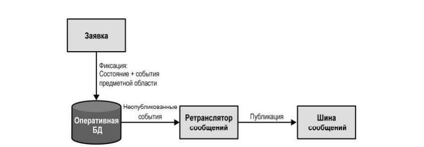

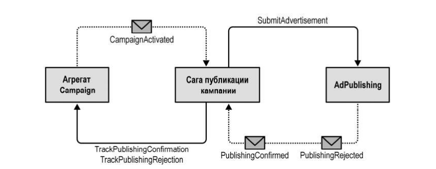

---

# Часть III. Применение DDD на практике

## Глава 10. Эвристика проектирования

Глава сшивает первые две части: как от типа поддомена дойти до конкретных технических решений. **Эвристика** — не строгое правило, а способ отбросить шум и опереться на главный сигнал; она не обязана быть верной в 100% случаев.

**Границы контекста.** «Какого размера должен быть контекст» — наименее полезный вопрос. Размер должен быть функцией модели, а не наоборот. Изменение, задевающее несколько контекстов, дорого и сигнализирует о плохих границах, а перекраивать физические границы куда дороже, чем логические. Отсюда правило: **начинать с широких границ и сужать по мере понимания домена**, особенно вокруг основных поддоменов — они самые изменчивые и хуже всего изучены на старте. В контекст с core-поддоменом полезно включить те поддомены, с которыми он взаимодействует чаще всего.

**Выбор паттерна бизнес-логики** — четыре вопроса по порядку:
1. Поддомен ведёт деньги, обязан иметь журнал аудита или нужен глубокий анализ поведения? → модель предметной области, основанная на событиях.
2. Логика особо сложная? → модель предметной области.
3. Сложные структуры данных? → активная запись.
4. Иначе → транзакционный сценарий.

Как отличить сложную логику от простой: сложная — это составные правила, инварианты и алгоритмы; простая — в основном валидация ввода. Вторая проверка — по единому языку: он описывает CRUD или всё-таки бизнес-процессы и правила?

**Выбор архитектуры** следует из паттерна логики: event-sourced модель требует CQRS (иначе запросить можно только один агрегат по идентификатору); модель предметной области требует портов и адаптеров; активная запись — слоистая архитектура с прикладным слоем; транзакционный сценарий — минимальная трёхслойная. Исключение: CQRS уместен с любым паттерном, если данные нужны в нескольких моделях хранения.

**Стратегия тестирования** тоже выводится оттуда же: пирамида (упор на модульные) — для обеих моделей предметной области, агрегаты и объекты-значения идеальны для юнит-тестов; ромб (упор на интеграционные) — для активной записи, где логика размазана между прикладным слоем и слоем логики; перевёрнутая пирамида (упор на сквозные) — для транзакционного сценария.

**Обратная проверка.** Выбор паттерна — способ проверить гипотезу о типе поддомена. Если поддомен считается основным, но напрашивается транзакционный сценарий, или считается вспомогательным, но требует модели предметной области — гипотеза, скорее всего, неверна. Автор оговаривается: дерево решений отражает его склонность брать сложные паттерны только по необходимости; встречались команды, которым проще было применять event sourcing везде.

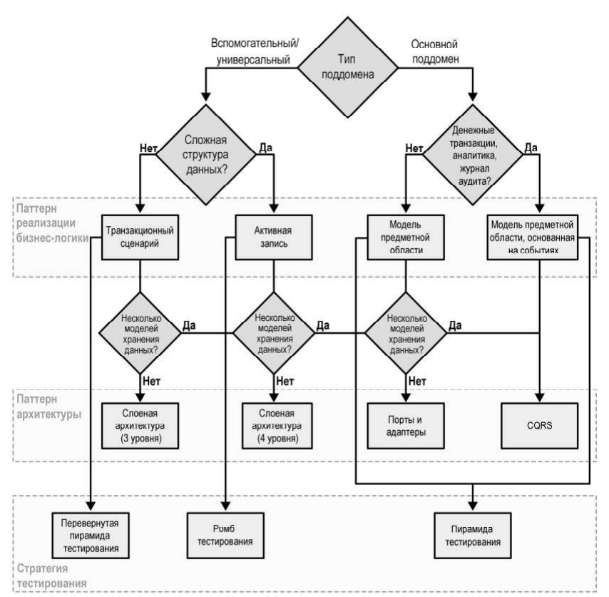

## Глава 11. Эволюция проектных решений

Четыре вектора изменений, из-за которых вчерашнее правильное решение перестаёт быть правильным.

**1. Меняется предметная область.** Поддомены переходят из типа в тип, и это меняет всё остальное.
- *Основной → универсальный:* BuyIT сама оптимизировала маршруты доставки, но появилась DeliveryIT с готовым сервисом — лучше и дешевле; преимущество испарилось, потому что доступно всем.
- *Универсальный → основной:* та же BuyIT отказалась от коробочного управления запасами ради своего прогноза спроса. Реальный пример — Amazon, превративший собственную инфраструктуру в AWS.
- *Вспомогательный → основной:* признак — растущая сложность бизнес-логики. Если сложность не приносит денег, её незачем добавлять; значит, она их приносит.
- Обратные переходы происходят, когда сложность перестала окупаться.
- Последствия: core нельзя дублировать «разными путями» — придётся переходить к потребитель-поставщик; ставший основным поддомен возвращают из аутсорса внутрь, а переставший — наоборот, отдают.

**2. Тактический сигнал.** Главный признак смены типа — существующий дизайн перестал тянуть требования: добавлять функциональность стало мучительно. Это призыв пересмотреть домен, а не героически продолжать. Пути миграции:
- *Транзакционный сценарий → активная запись:* найти усложнившиеся структуры данных и инкапсулировать их.
- *Активная запись → модель предметной области:* сначала выделить объекты-значения; затем **сделать сеттеры приватными — компилятор сам покажет, где снаружи меняют состояние**; перенести эту логику внутрь; сгруппировать в наименьшие границы строгой согласованности; назначить корни агрегатов.
- *Модель → event-sourced модель:* сложность в истории. Либо **сгенерировать прошлые события** по текущему состоянию (проекция сойдётся с оригиналом, но история будет неполной — сколько раз звонили клиенту, уже не узнать), либо **смоделировать событие миграции** `migrated-from-legacy` (честно признаёт отсутствие истории, но след легаси останется в хранилище навсегда, и проекции всегда должны его учитывать).

**3. Организационные изменения.** Новые команды дробят широкие контексты — контекстом владеет одна команда. Переезд команды в другой регион ломает партнёрство и переводит его в потребитель-поставщик; дальнейшие проблемы связи могут довести до разных путей.

**4. Знания и рост.** Знания не только накапливаются, но и теряются: документация устаревает, люди уходят. Эвристика: **проектировать границы контекстов по уровню понимания домена** — пока логика туманна, границы широкие, потом дробить. Рост проекта сам по себе здоров, но без пересмотра границ превращает систему в большой ком грязи. Регулярно перепроверять: не пора ли разбить разросшийся поддомен по согласованным сценариям; не стал ли контекст «обо всём и ни о чём» (болтливость — операция не завершается без вызова соседа — прямой сигнал); не разросся ли агрегат сверх строго согласованных данных. Цель — снимать непреднамеренную сложность, а существенной управлять инструментами DDD.

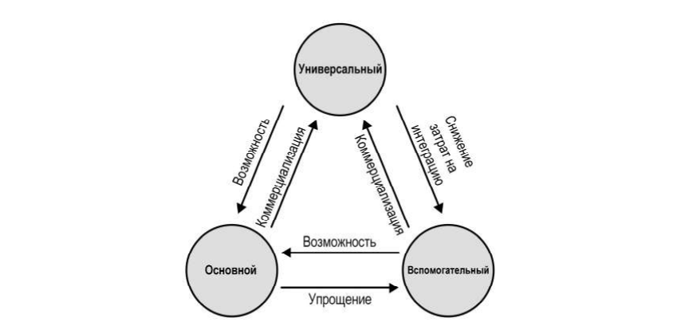

## Глава 12. EventStorming

Низкотехнологичный воркшоп: стикеры, маркеры, стена с рулонной бумагой и разнородная группа до 10 человек — инженеры, эксперты, продакты, QA, поддержка. Стульев в зале лучше не оставлять, закуски взять: сессия идёт 2–4 часа.

**Десять этапов**
1. **Неструктурированное исследование.** Все пишут события предметной области (оранжевые стикеры, прошедшее время) вразнобой, пока поток не иссякнет.
2. **Хронология.** Сначала выстроить успешный сценарий (happy path), затем ветки с ошибками и альтернативами; заодно убрать дубли и добавить недостающее.
3. **Проблемные места (pain points)** — розовые стикеры ромбом: узкие места, ручные операции, пробелы в знаниях. Фиксируются в течение всей сессии, а не только на этом шаге.
4. **Ключевые события (pivotal events)** — вертикальная черта там, где меняется контекст: «корзина инициализирована», «заказ отправлен», «заказ возвращён». **Это индикаторы будущих границ ограниченных контекстов.**
5. **Команды** — голубые стикеры в повелительном наклонении, ставятся перед событиями. Действующее лицо (actor) — маленький жёлтый стикер перед командой.
6. **Правила (policies)** — лиловые стикеры между событием и командой: автоматизация «когда произошло X, выполнить Y». Условие пишется прямо на стикере («только для VIP-клиентов»).
7. **Модели чтения (read models)** — зелёные: то, что действующее лицо смотрит перед тем, как выполнить команду (экран, отчёт, уведомление).
8. **Внешние системы** — розовые. К концу этапа у каждой команды есть источник: актор, правило или внешняя система.
9. **Агрегаты** — большие жёлтые стикеры: команды слева, события справа.
10. **Ограниченные контексты** — группы связанных агрегатов.

**Ключевое**
- Автор на практике делает иначе: сперва общая картина по всей компании (этапы 1–4), она даёт основу единых языков и наброски границ; потом отдельная полная сессия на каждый выявленный бизнес-процесс.
- **Ценность в процессе, а не в модели.** Артефакты — приятный бонус; главное — участники синхронизировали ментальные модели, нашли конфликты и заговорили на едином языке.
- Зачем проводить: выработать единый язык, смоделировать процесс, разобрать новые требования и найти в них граничные случаи, **восстановить утраченные знания о легаси**, поискать улучшения процесса, ввести новых сотрудников.
- Когда не стоит: процесс прост и очевиден, без интересной логики.
- Удалённо (miro и аналоги) работает хуже — создатель метода был против; автор ограничивает онлайн-сессию пятью участниками и при необходимости проводит несколько с последующим сведением моделей.

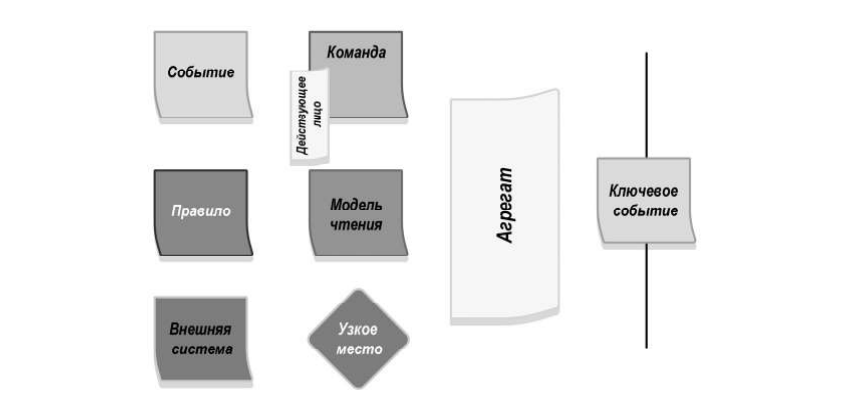

## Глава 13. DDD на практике

Главный тезис: DDD выгоднее всего не на гринфилде, а на живых системах с техдолгом — то есть там, где мы и проводим большую часть карьеры. И это не подход «всё или ничего»: применять весь набор паттернов не обязательно.

**Стратегический анализ.** Сначала домен: чем компания занимается, кто клиенты, какую ценность она даёт, с кем конкурирует. Затем поддомены — отталкиваясь от оргструктуры. Признаки типов:
- *Основной* — уникальная особенность, интеллектуальная собственность, алгоритмы; может быть и нетехнической (кадры, дизайн). Печальная, но рабочая эвристика: **основной поддомен часто оказывается тем самым большим комом грязи**, который все ненавидят, но бизнес боится переписывать, потому что заменить готовым решением нельзя, а любое изменение несёт риск.
- *Универсальный* — то, что уже куплено, подписано или взято из open source.
- *Вспомогательный* — остальное: заменить готовым нельзя, преимущества не даёт, меняется редко, и потому кривой код тут терпим.

**Оценка текущего дизайна.** Разбить систему на высокоуровневые компоненты по критерию независимого жизненного цикла (разрабатывается, тестируется, деплоится отдельно), проверить, какие поддомены в каждом и соответствует ли паттерн сложности задачи, затем нарисовать карту контекстов и искать в ней болезни: несколько команд на одном компоненте, продублированный core, core на аутсорсе, регулярные конфликты интеграции, навязанные легаси-модели.

**Модернизация — маленькими шагами.**
- Большое переписывание почти никогда не удаётся и редко получает поддержку руководства. Начинать с дешёвого и безопасного: **выровнять логические границы модулей по границам поддоменов**, а не по техническим слоям. Не забыть про логику, живущую в хранимых процедурах и serverless-функциях.
- Дальше превращать в физические границы там, где это даёт максимум: если над кодовой базой работает несколько команд или если в ней столкнулись конфликтующие модели.
- Затем чинить интеграцию: рассыпавшееся партнёрство → потребитель-поставщик; защита от легаси и частых изменений → ACL; расползание деталей реализации к потребителям → OHS; конфликты команд вокруг некритичной функциональности → разные пути.
- **Паттерн «Душитель» (strangler)** — новый контекст растёт поверх старого: вся новая функциональность идёт в него, старый только чинится, постепенно всё мигрирует, и легаси умирает. В паре с **фасадом**, который маршрутизирует запросы между старым и новым и удаляется по завершении. Здесь допустимо временно нарушить правило «одна база на контекст» — общая база избавляет от распределённых транзакций на время миграции.
- Тактический рефакторинг: **не прыгать из активной записи сразу в event sourcing** — сначала агрегаты на состоянии, найти правильные границы, и только потом события. Ошибиться в границах у event-sourced агрегата куда дороже. Модель предметной области вводится по частям, начиная с объектов-значений.

**Как «продать» DDD.** Если руководство не готово — не продавать как методологию, а использовать как личный инструментарий. Единый язык — просто здравый смысл: слушать язык бизнеса, вылавливать противоречивые термины, требовать разъяснений, говорить с экспертами неформально. Паттерны обосновывать не авторитетом книги, а логикой: почему граница транзакции защищает согласованность; почему одна транзакция меняет один агрегат; почему логика не выносится в хранимую процедуру (продублированная логика в физически разнесённых местах рассинхронизируется). А event sourcing лучше «продавать» не команде, а экспертам предметной области — увидев, какую глубину истории он даёт, они сами становятся его сторонниками.

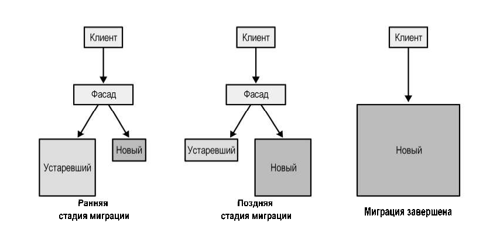

---

# Часть IV. Взаимоотношения с другими методологиями

## Глава 14. Микросервисы

«Ограниченный контекст» и «микросервис» часто употребляют как синонимы. Глава показывает, что это не одно и то же, и объясняет, откуда берутся распределённые комья грязи.

**Термины**
- **Сервис** — механизм доступа к бизнес-компетенциям через предписанный интерфейс. Публичный интерфейс — «входная дверь», и он же определяет суть сервиса.
- **Микросервис** — сервис с **микро-публичным интерфейсом**. Отсюда следует запрет на прямой доступ к чужой базе: открыть базу значит сделать входной дверью произвольный SQL, то есть бесконечно широкий интерфейс.
- **Локальная и глобальная сложность** — сложность отдельного сервиса и сложность связей между сервисами. Минимизировать глобальную тривиально (всё в монолите), минимизировать локальную тоже (сервис на метод) — и оба крайних решения дают ком грязи, во втором случае распределённый. Оптимум балансирует обе.
- **Глубокий модуль (deep module)** по Оустерхауту — прямоугольник, ширина которого равна сложности публичного интерфейса (функция), а площадь — сложности логики. Хороший модуль глубокий: узкий интерфейс поверх сложной логики. `int AddTwoNumbers(a, b)` — предельно мелкий модуль: интерфейс и логика совпадают, он лишь добавляет системе движущихся частей.

**Ключевое**
- **Все микросервисы — ограниченные контексты, но не все контексты — микросервисы.** Контекст задаёт границу *самого большого допустимого монолита* (и это жизнеспособный дизайн, а не ком грязи), микросервис — наименьшую допустимую границу сервиса. Между ними лежит безопасная зона; шире контекста — ком грязи, мельче микросервиса — распределённый ком грязи.
- Агрегат как микросервис — почти всегда плохая идея: это самая узкая из возможных границ. Проверять связанность: обменивается ли агрегат данными с соседями по поддомену, делит ли объекты-значения, разъезжаются ли их изменения.
- **Самая безопасная эвристика — выравнивать сервисы по границам поддоменов.** Поддомен отвечает на вопрос «что», скрывая «как», и состоит из согласованных сценариев использования на общих данных — то есть естественно является глубоким модулем.
- Определения через «не больше X строк кода» или «легче переписать, чем изменить» смотрят на отдельный сервис и упускают систему — именно из-за них проекты и проваливаются.
- OHS и ACL делают сервисы «глубже»: опубликованный язык сужает публичный интерфейс поставщика, а вынесенный в отдельный сервис ACL забирает сложность интеграции у потребителя.

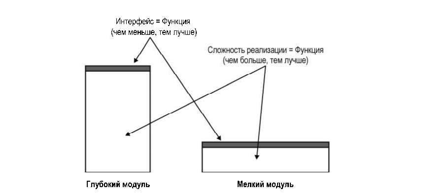

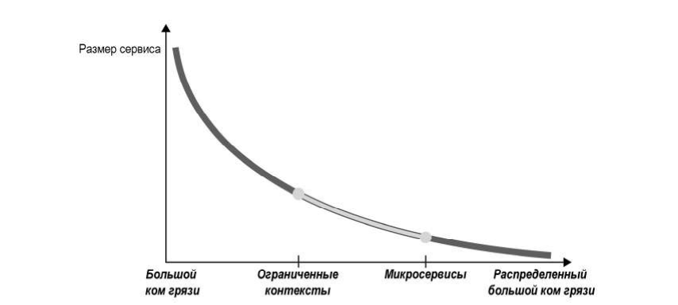

## Глава 15. Событийно-ориентированная архитектура

События — не приправа, от которой система становится слабосвязанной. Неосторожный EDA превращает модульный монолит в распределённый ком грязи.

**Разграничение.** EDA — про взаимодействие *между* сервисами; event sourcing — про фиксацию переходов состояния *внутри* сервиса. Событие описывает уже случившееся и не может быть отменено получателем (только компенсировано командой); команда предписывает действие и может быть отклонена.

**Три типа событий**
- **Уведомление (event notification)** — «случилось важное», без подробностей: подписчик идёт за деталями по ссылке. Аналогия из книги — система экстренных оповещений (WEA/EU-Alert) с лимитом 360 знаков: хватает узнать о ЧП, подробности ищешь сам. Полезно для безопасности (конфиденциальные данные не летят через шину, нужна отдельная авторизация) и против гонок (за актуальным состоянием идёшь явно, можно добавить пессимистичную блокировку для конкурирующих потребителей).
- **Передача состояния событием (event-carried state transfer, ECST)** — полный срез изменённого объекта или только изменившиеся поля. По сути асинхронная репликация: потребитель держит локальный кеш и продолжает работать, даже когда поставщик недоступен.
- **Событие предметной области (domain event)** — описывает бизнес-событие в жизненном цикле агрегата со всеми его данными. Моделируется для описания домена, а не для интеграции, и полезно, даже если внешних потребителей нет.

**Один и тот же факт тремя способами:** `marriage-recorded` (уведомление: только факт и ссылка) / `personal-details-changed` с новой фамилией (ECST: что изменилось, но непонятно, свадьба это или развод) / `married` с идентификатором партнёра и флагом смены фамилии (событие предметной области).

**Как получается распределённый ком грязи** (случай из практики): CRM на event sourcing даёт всем подписаться на свои события предметной области.
- *Связанность по времени* — Reporting должен считать после AdsOptimization, и это «решено» пятиминутной задержкой. Не гарантирует ничего: сервис может быть перегружен, сеть — тормозить, потребитель — упасть.
- *Функциональная связанность* — Marketing и AdsOptimization строят одну и ту же проекцию клиента, то есть дублируют бизнес-логику, меняющуюся по одной и той же причине.
- *Связанность на уровне реализации* — оба подписаны на все события CRM, поэтому новое событие или изменение схемы внутри CRM ломает или рассогласовывает подписчиков.

**Как чинить.** Логику проекции инкапсулировать у поставщика: CRM проецирует модель, нужную потребителям, и публикует её как часть опубликованного языка (контракт, ориентированный на потребителя). Временную связанность убрать уведомлением: AdsOptimization досчитал — послал уведомление, Reporting пошёл за данными.

**Эвристики**
- Предполагать худшее: сеть медленная, серверы падают, события придут не по порядку и продублируются — и обычно в выходные. Отсюда outbox для публикации, дедупликация и переупорядочивание у подписчиков, саги и диспетчеры процессов для компенсаций.
- Разделять публичные и приватные события. События — часть публичного интерфейса контекста; **события предметной области наружу отдавать как можно реже**, вместо них — специально спроектированный набор.
- Выбирать тип по требованиям к согласованности: хватает согласованности в конечном счёте — ECST; нужно свежайшее состояние — уведомление плюс явный запрос.

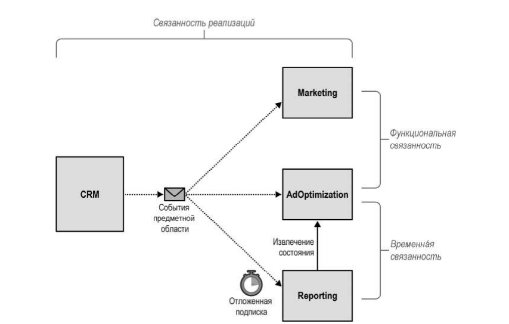

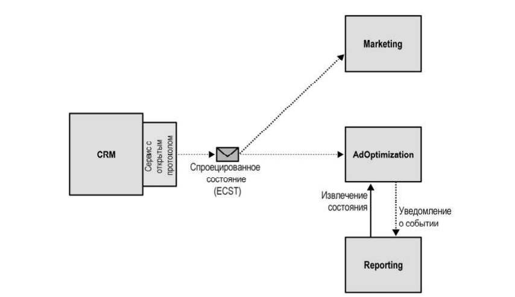

## Глава 16. Сеть данных, Data Mesh

Всё предыдущее было про транзакционные (OLTP) модели. Эта глава — про аналитические (OLAP) и про то, почему их нельзя строить из первых напрямую.

**Термины**
- **Факт (fact)** — запись о уже случившейся бизнес-активности, аналог события предметной области, но без требования прошедшего времени в названии: `Fact_Sales`, `Fact_CustomerOnboardings`. Только на добавление; устаревание отмечается новой записью. Детализация выбирается аналитиками — например, срез состояния заявок раз в 30 минут, а не на каждое изменение.
- **Измерение (dimension)** — описание факта (факт — глагол, измерение — прилагательное), ссылка по внешнему ключу. Сильно нормализовано, потому что запросы к аналитике непредсказуемы и должны быть гибкими.
- **Схема «звезда»** — факты и одноуровневые измерения; **схема «снежинка»** — измерения нормализованы дальше: экономит место, но требует больше соединений.

**Что не так с классикой**
- **Хранилище данных (data warehouse)** — ETL превращает данные всех систем в одну модель на всё предприятие. Это та же ошибка, что и общая транзакционная модель на всю компанию. Витрины данных (data mart) чинят проблему частично: наполняясь из хранилища, они всё равно требуют общей модели, а наполняясь напрямую, затрудняют кросс-витринные запросы.
- **Озеро данных (data lake)** — сырые данные складываются как есть, модели строятся потом. Даёт несколько моделей под разные задачи, но без схемы и контроля качества на масштабе превращается в **болото данных**, а аналитики держат по нескольку версий одного ETL под разные версии транзакционной модели.
- Общая беда обеих архитектур: ETL лезет прямо в транзакционные базы, то есть **привязывается к деталям реализации в обход публичных интерфейсов**. Любое изменение схемы ломает скрипты, из-за чего изменения транзакционной модели начинают тормозить — особенно больно в DDD-проектах, где модель постоянно эволюционирует. Плюс аналитики сидят в отдельном подразделении и знают домен хуже разработчиков.

**Четыре принципа data mesh**
1. **Разбиение данных по предметным областям** — вместо монолитной аналитической модели несколько моделей, чьи границы владения совпадают с ограниченными контекстами. Команда, владеющая OLTP-моделью, отвечает и за её преобразование в OLAP.
2. **Данные как продукт** — аналитика отдаётся через явные выходные порты и живёт по правилам публичного API: обнаруживаемые эндпоинты, описанная схема, достоверность, SLA, версионирование и обработка несовместимых изменений. В команду добавляется дата-инженер.
3. **Автономия** — отдельная команда платформы данных даёт шаблоны продуктов данных, единый доступ, контроль прав и разные типы хранилищ, чтобы каждая команда не изобретала своё.
4. **Экосистема** — объединённый орган управления из владельцев продуктов данных и представителей платформы задаёт правила совместимости.

**Связь с DDD.** Data mesh — это, по сути, DDD применительно к аналитике. Отдача данных в модели, отличной от транзакционной, — это сервис с открытым протоколом, а аналитическая модель — ещё один опубликованный язык. CQRS даёт механизм построения этих моделей и позволяет держать сразу несколько версий схемы. Паттерны интеграции контекстов работают и между аналитическими моделями: партнёрство, ACL против неудачной чужой модели, разные пути.

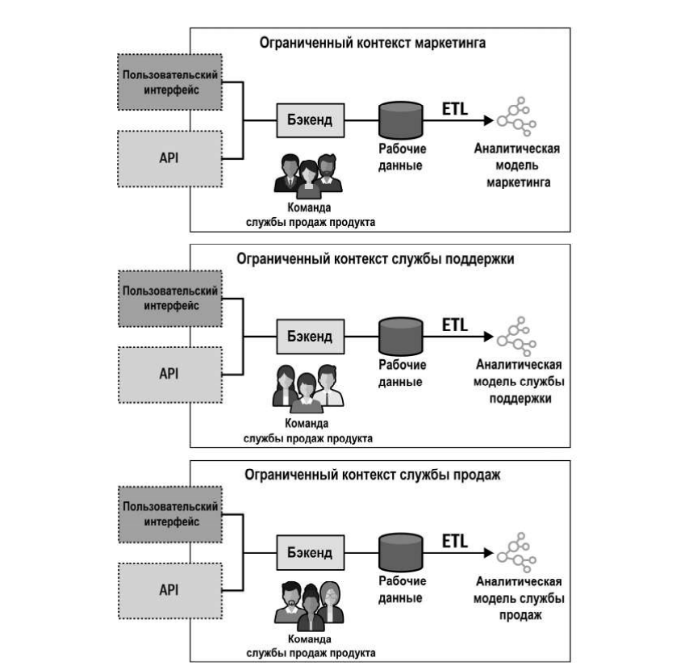

---

## Приложение 1. Применение DDD: пример из практики

История стартапа Marketnovus (компании уже нет, поэтому автор рассказывает честно): маркетинг на аутсорсе — стратегия, креативы, кампании, обзвон лидов, аналитика поверх всего. Пять контекстов и пять уроков.

1. **Маркетинг.** Архитектура «повсюду агрегаты»: каждое существительное из требований объявлено агрегатом, всё в одном монолите, а поведение — в огромном сервисном слое. То есть классическая анемичная модель. При этом бизнес счёл проект успехом: спасал **надёжный единый язык**, выстроенный с экспертами.
2. **CRM.** Появились неудобные префиксы `CRMLead` и `MarketingLead`, которых никто не использовал в разговорах, — так обнаружились ограниченные контексты. Монолит разделили на два, в CRM решили сделать «всё по книге» — и не уложились в сроки. Руководство отдало часть логики команде DBA, в хранимые процедуры, и **граница неявного контекста разрезала самый сложный агрегат Lead**. Две команды, два словаря, дублированные правила, рассинхронизация и испорченные данные. Переделывали агрегат Lead пару лет спустя.
3. **Обработчики событий.** Логика, которая не принадлежала ни маркетингу, ни CRM, — вынесли в отдельный контекст как вспомогательный поддомен: слоистая архитектура и транзакционные сценарии. Затем BI попросил «пару флажков», флажки обросли правилами и инвариантами, поддомен стал основным, а транзакционные сценарии — комом грязи. Через год переписали в event-sourced модель.
4. **Бонусы.** Расчёт комиссий агентам, тоже вспомогательный поддомен на активных записях. История повторилась: аналитики захотели разные проценты, привязки к объёмам, дополнительные цели. Но здесь **был единый язык**, и по тому, как усложнялась речь экспертов, необходимость смены дизайна заметили сильно раньше — сэкономив время.
5. **Центр маркетинга.** Бизнес назвал направление основным, поэтому достали тяжёлую артиллерию: event sourcing, CQRS и микросервисы с границами по агрегатам. Сервисы стали болтливыми, система превратилась в распределённый монолит. Хуже того, за сложной архитектурой стояла простая логика: конкурентное преимущество было в отношениях с компаниями, а не в алгоритмах. Чистая непреднамеренная сложность, всё перепроектировали.

**Выводы автора**
- **Единый язык — «основной поддомен» самого DDD** и главный предвестник успеха: он вытянул слабую архитектуру в маркетинге и его отсутствие погубило CRM. Чинить уже прижившийся в компании язык почти невозможно — реализацию исправили, а противоречивые термины люди использовали годами.
- Marketnovus прошла почти все переходы типов поддоменов: вспомогательный → основной (обработчики событий, бонусы), вспомогательный → универсальный (каталог креативов заменили open source), основной → универсальный (скоринг лидов заменили облачной ML-моделью), основной → вспомогательный (центр маркетинга).
- **Приём против ошибки в определении типа: перевернуть связь.** Выбрать паттерн, который реально требуется задачей, вывести из него тип поддомена и сверить с бизнесом. Если «основной» ломается за день — либо надо искать более мелкие поддомены, либо у бизнеса проблемы. Если «вспомогательный» требует модели предметной области — либо требования зря усложнили, либо бизнес ещё не понял, что нашёл новый источник прибыли (так и было с бонусами).
- **Не игнорировать боль.** Трудность внесения изменений — сигнал, что поддомен эволюционировал.
- Из перепробованных стратегий границ (лингвистические, по поддоменам, по сущностям и «суицидальные» — разрезавшие агрегат) работает правило: **безопаснее выделять сервис из большего, чем начинать с мелких**; чем меньше знаешь о домене, тем шире стартовые границы.
- Итог эволюции взглядов: от «повсюду агрегаты» к «повсюду единый язык».

---

## Шпаргалка

**Тип поддомена → стратегия**

| Тип | Преимущество | Сложность | Изменчивость | Как делать |
|---|---|---|---|---|
| Основной (core) | да | высокая | высокая | самим, лучшими людьми, лучшими практиками |
| Универсальный (generic) | нет | высокая | низкая | купить или взять готовое |
| Вспомогательный (supporting) | нет | низкая | низкая | самим, просто; можно аутсорс |

**Паттерн бизнес-логики — четыре вопроса по порядку**

1. Деньги, журнал аудита или нужен глубокий анализ поведения? → **event-sourced domain model** → архитектура **CQRS** → тесты **пирамидой**.
2. Сложные правила и инварианты? → **модель предметной области** → **порты и адаптеры** → **пирамида**.
3. Сложные структуры данных? → **активная запись** → слоистая архитектура с прикладным слоем → **ромб** (упор на интеграционные).
4. Иначе → **транзакционный сценарий** → минимальная слоистая → **перевёрнутая пирамида** (упор на сквозные).

**Интеграция контекстов — по отношениям команд**

| Ситуация | Паттерн |
|---|---|
| Тесное сотрудничество, частая синхронизация | партнёрство |
| Общая часть модели, координация дешевле дублирования | общее ядро |
| Модель поставщика устраивает | конформист |
| Модель поставщика не устраивает, ниже по течению core | предохранительный слой (ACL) |
| Защитить своих потребителей от изменений | сервис с открытым протоколом (OHS) |
| Дублировать дешевле, чем договариваться (но не для core) | разные пути |

**Границы**
- Поддомены выявляются, ограниченные контексты проектируются.
- Микросервис — наименьшая допустимая граница, ограниченный контекст — наибольшая. Между ними безопасная зона; самая надёжная эвристика — выравнивать сервисы по поддоменам.
- Один агрегат на транзакцию; агрегат — минимальный набор строго согласованных данных; наружу — только по идентификаторам.
- Один ограниченный контекст — одна команда (но команда может вести несколько).
- Чем хуже понятен домен, тем шире стартовые границы.

**Типы событий наружу**
- Нужно свежайшее состояние → уведомление плюс явный запрос.
- Достаточно согласованности в конечном счёте → передача состояния событием (ECST).
- События предметной области наружу — как можно реже: это деталь реализации.
